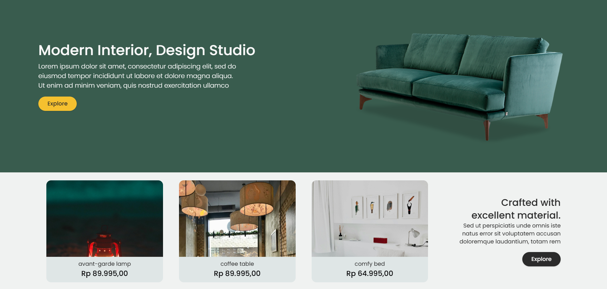

# Furni

<div align="center" width="100%">
   
</div>

## Introduction

Furni is the platform that revolutionizes the way you purchase furniture, making transactions effortless and efficient..

Click [_here_](https://furni-sigma.vercel.app/) for result.

## Features

- **Modern Stack**: Built with React.js, a powerful library, TailwindCSS and Shadcn/ui for responsive and elegant styling.
- **Responsive Design**: Ensure a seamless experience across various devices and screen sizes.
- **Huge selections of Furniture**: Discover your dream furniture.

## ⚙️ Tech Stack

- React Js
- Tailwind CSS
- Shadcn/ui
- Redux

## Installation

1. Clone this repository to your local machine using:

   ```bash
   git clone https://github.com/Gerardusdavidbayuaji/furni.git
   ```

2. Navigate to the project directory:

   ```bash
   cd furni
   ```

3. Install the dependencies:

   ```bash
   npm install
   ```

## Usage

1. Configure your database settings in the .env file.
2. Start the development server:
   ```bash
   npm run dev
   ```
3. Access the application in your browser at http://localhost:5173.
